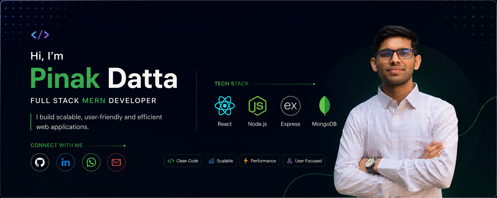

<!-- Banner -->

 

<!-- Typing SVG -->

  

  

<!-- Social Badges -->

---

## 👨‍💻 About Me

I'm a **Full-Stack MERN Developer** who builds **scalable, production-grade web applications** with a strong focus on clean architecture and polished UI/UX.

- 🌱 Exploring **Next.js** for SSR/SSG patterns and modern performance optimization
- 💡 Passionate about integrating **AI** into real-world applications
- 🏆 Background in **Competitive Programming** — algorithmic thinking drives how I solve engineering problems
- 🚀 Shipped production-level projects including **e-commerce platforms** and **internal dashboards**
- 🌍 Explore my **[Portfolio](https://pinak-portfolio.netlify.app)** and **[Resume](./resume.pdf)**
- 💼 Connect with me on **[LinkedIn](https://www.linkedin.com/in/pinakdatta57/)**
- 📧 Reach me anytime via **[Email](mailto:pinakdattatp@gmail.com)**

---

## 🛠️ Tech Stack

**Frontend**

**Backend & Database**

**Languages**

**Tools & Platforms**

---

## 📊 GitHub Stats

&nbsp;&nbsp;

---

## 🚀 Featured Projects

| 🌟 Project | 📝 Description | 🛠️ Tech Stack |
| :--- | :--- | :--- |
| **🍲 LocalChefBazaar** | Role-based marketplace with dashboards for Users, Chefs, and Admins, secure JWT authentication, Stripe payments, analytics, and image uploads. | React • Node.js • Express • MongoDB • Firebase • JWT • Stripe • Recharts |
| **🏠 HomeNest** | Property management platform where users can browse, add, search, review, and manage rental or sale listings securely. | React • Firebase Firestore • Firebase Auth • Tailwind CSS • MongoDB |
| **💼 Personal Portfolio** | Dark-themed portfolio with smooth animations, typewriter hero section, animated counters, and project detail pages. | React 18 • Framer Motion • React Router v6 • CSS Modules |

*"Good code is its own best documentation."*

